# 快速入门

SECoder 是软件工程课程所使用的开发平台, 它将服务同学们的小作业与大作业部署,
并且通过开源项目 GitLab 托管代码.

## 注册平台并激活账号

从助教处获得平台的初始密码后, 请前往
[secoder.net](https://secoder.net/register) 进行注册以便激活账号.

如果无法打开网页, 请在校园网环境内访问.

### 注册步骤

1. **打开注册页面**

   访问 https://backend.t.adamanteye.cc/register 或 https://secoder.net/register

2. **填写注册信息**

   在注册页面中填写以下信息:

   - **姓名**: 建议填写真实姓名, 便于课程管理
   - **账号**: 填写你的学号
   - **电子邮箱**: 填写最常用的邮箱, 与平时提交代码所使用的邮箱保持一致
   - **密码**: 使用助教提供的初始密码

   

     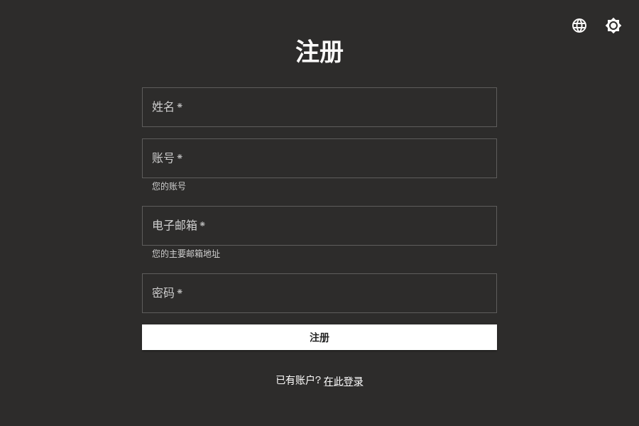
     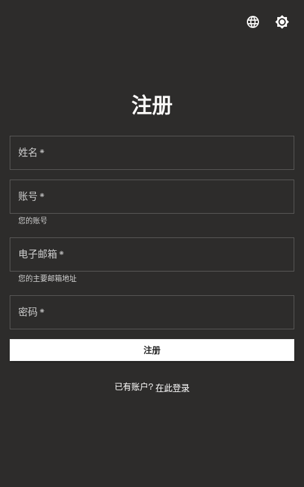
   

3. **完成注册**

   填写完所有信息后, 点击 **注册** 按钮提交注册信息.

4. **激活账号**

   注册成功后, 你的账号即被激活, 可以使用学号和密码登录 SECoder 平台.

## 激活 GitLab

SECoder 平台集成了 GitLab 代码仓库系统, 你可以通过 SECoder 账号直接登录 GitLab,
无需单独注册.

### 登录 GitLab

1. **打开主页并找到 GitLab 入口**

   登录 SECoder 平台后, 在主页可以看到 "GitLab 代码仓库和 CI/CD" 按钮.

   

     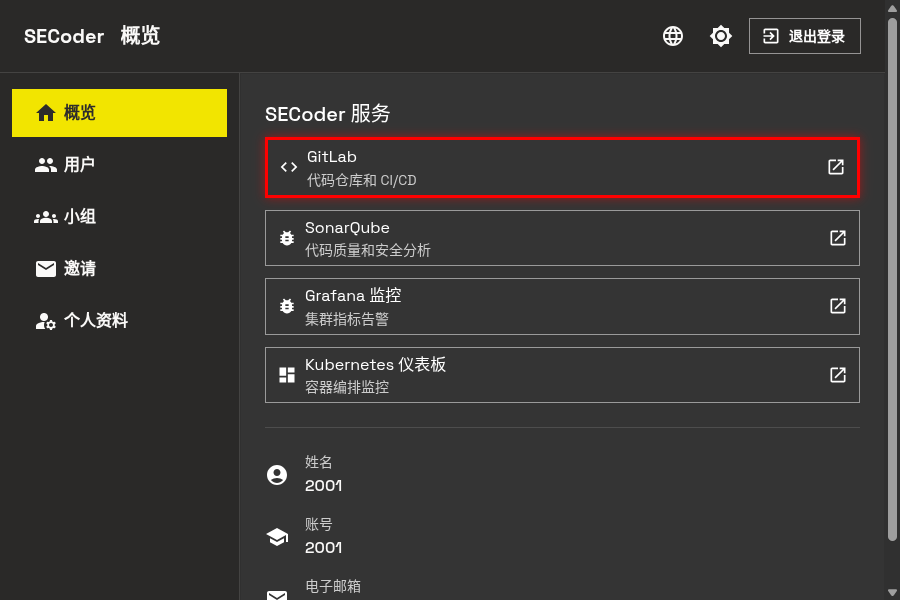
     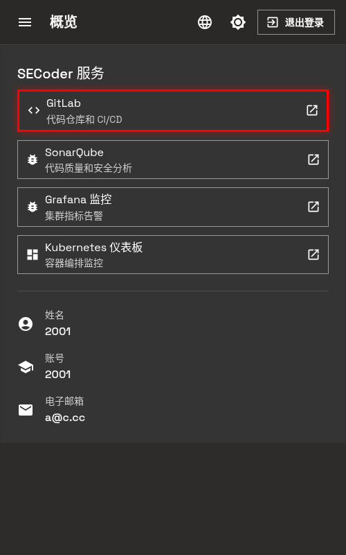
   

2. **进入 GitLab 登录页面**

   点击 "GitLab 代码仓库和 CI/CD" 按钮, 会打开 GitLab 登录页面.
   在页面下方可以看到 **secoder** 登录选项.

   

     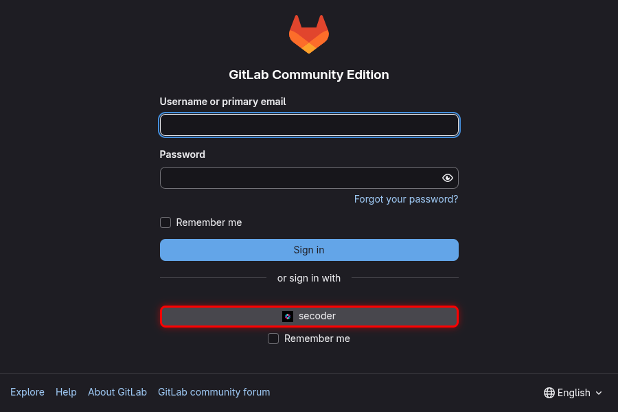
     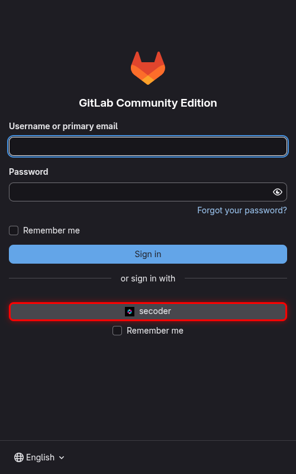
   

3. **通过 SECoder 授权登录**

   点击 **secoder** 按钮, 会跳转到 SECoder 授权页面.
   页面会显示将要同步给 GitLab 的信息 (账号、邮箱、姓名), 点击 **继续前往 GitLab** 完成授权.

   

     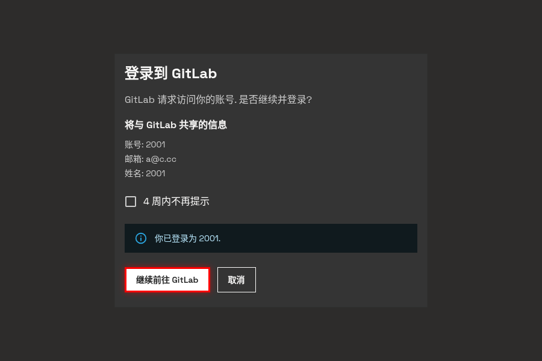
     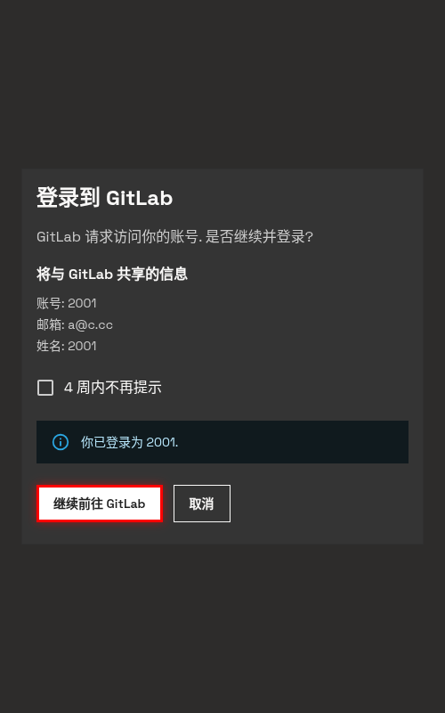
   

4. **登录成功**

   授权成功后, 会自动跳转到 GitLab 主页, 页面顶部会显示你的用户名, 表示登录成功.

   

     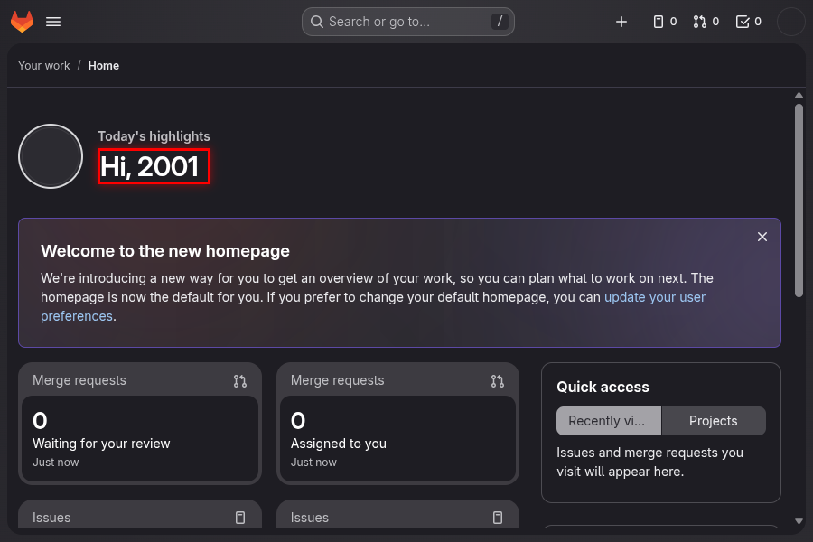
     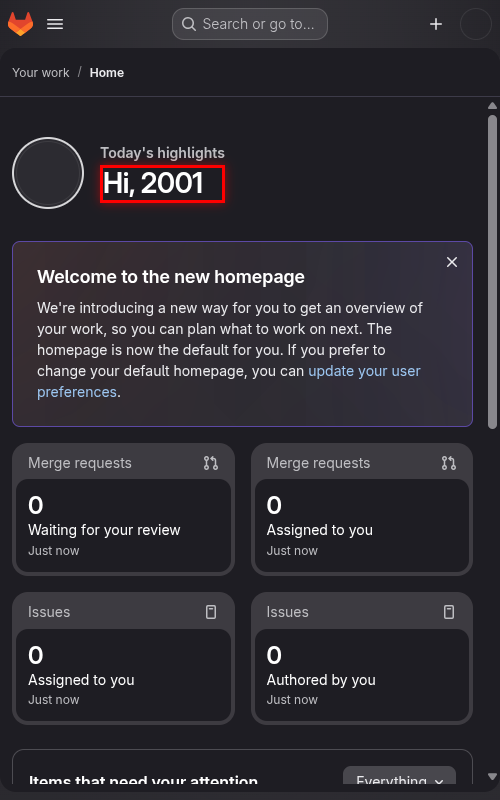
   

### 同步 GitLab 子组

登录成功后, SECoder 会自动将你的邮箱、姓名同步给 GitLab.
如果你在 SECoder 中修改了这些信息, 需要重新登录 GitLab 以更新.

为了在 GitLab 中创建属于你的群组, 你需要手动触发同步:

1. **进入个人资料页面**

   在 SECoder 平台点击 **个人资料** 菜单.

2. **同步 GitLab 子组**

   在个人资料页面中, 找到 **同步 GitLab 子组** 按钮并点击.

   

     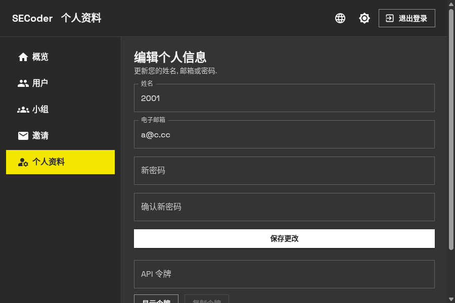
     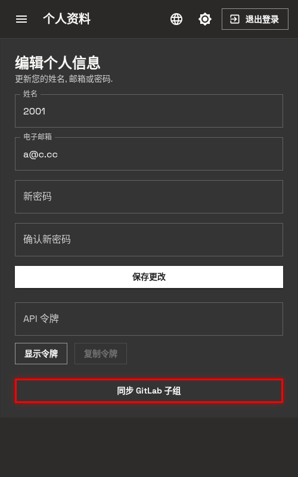
   

3. **完成同步**

   点击按钮后, 系统会在 GitLab 中为你创建对应的子组. 如果你的组队情况发生变更,
   例如加入了新的队伍, 需要再次点击同步按钮以更新群组信息.
