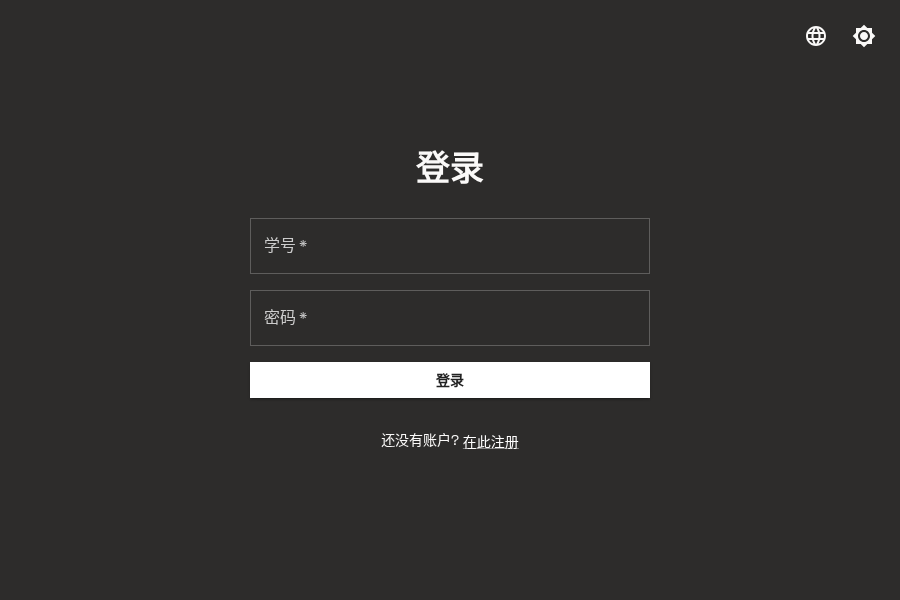
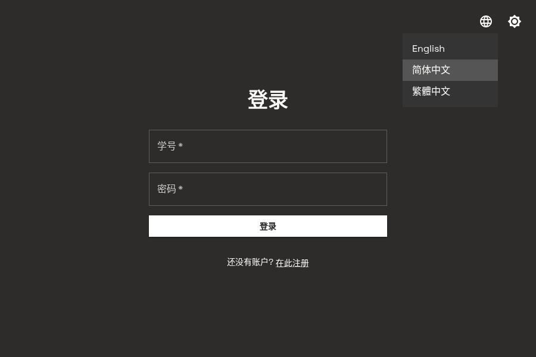
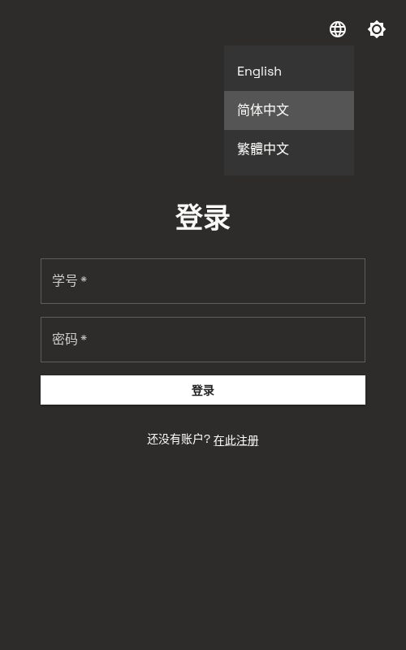
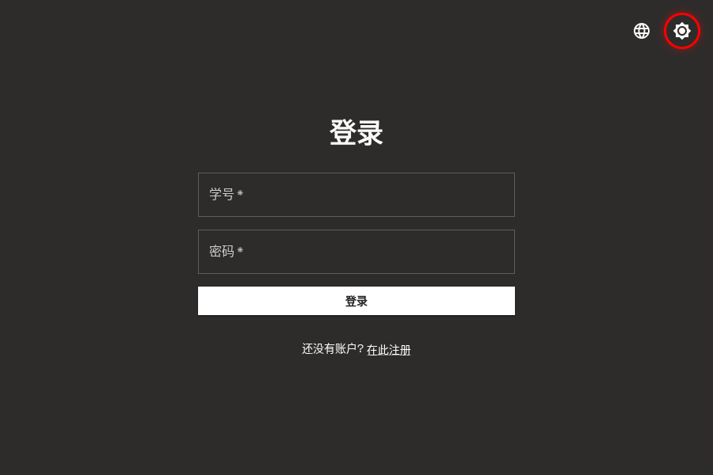
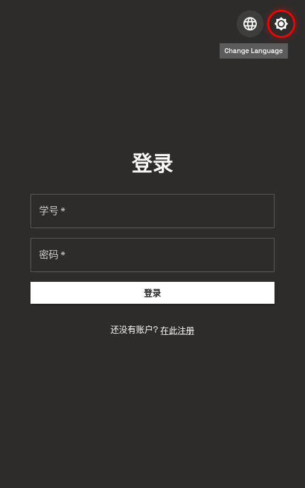
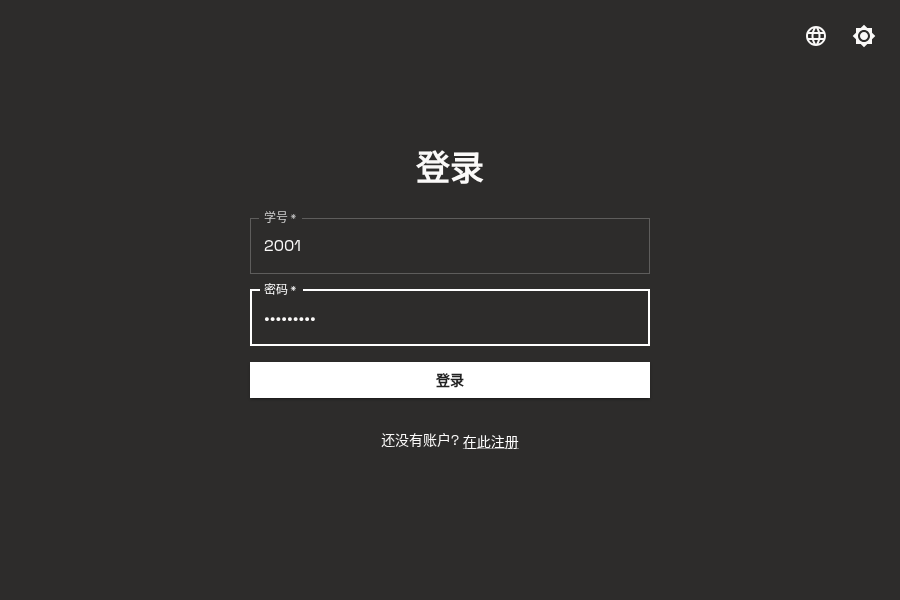
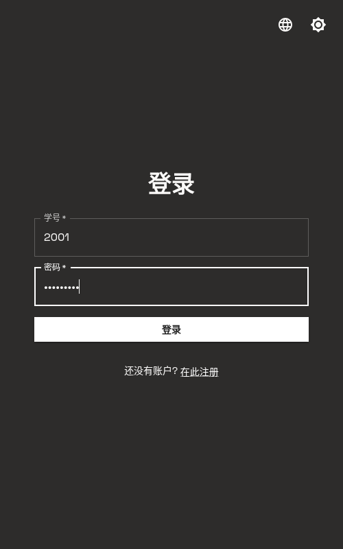

# 用户登录

登录是使用 SECoder 平台的第一步, 本章将指导你完成登录流程.

## 访问登录页面

在浏览器中打开 [https://secoder.net](https://secoder.net),
系统会自动跳转到登录页面.

  
  

## 语言切换

登录页面支持多语言切换, 你可以点击页面右上角的 **Change Language** 按钮,
在弹出的菜单中选择你需要的语言.

  
  

系统支持三种语言:

- **English** - 英文界面
- **简体中文** - 简体中文界面(默认)
- **繁體中文** - 繁体中文界面

选择语言后, 页面会立即切换到对应的语言显示.

## 主题切换

登录页面支持亮色和暗色模式切换, 你可以点击页面右上角的主题切换按钮来切换显示模式.

  
  

点击该按钮后, 页面会在亮色模式和暗色模式之间切换. 系统默认使用暗色模式.

## 登录页面元素

登录页面包含以下元素:

- **学号输入框**: 输入你的学号
- **密码输入框**: 输入你的密码
- **登录按钮**: 点击完成登录
- **注册链接**: 如果没有账号, 可以点击"在此注册"进行注册

## 填写登录信息

在对应的输入框中填写你的学号和密码.

  
  

1. 在 **学号** 输入框中填写你的学号
2. 在 **密码** 输入框中填写你的密码

## 完成登录

点击 **登录** 按钮完成登录.

  
  

登录成功后, 系统会跳转到概览页面, 你可以开始使用 SECoder 平台的各种功能.

## 常见问题

### 忘记密码

如果你忘记了密码, 请联系课程管理员重置密码.

### 账号被锁定

如果多次输入错误的密码, 账号可能会被暂时锁定. 请等待一段时间后重试, 或联系管理员.

### 无法登录

如果遇到无法登录的问题, 请检查:

- 学号和密码是否输入正确
- 浏览器是否支持(推荐使用 Chrome, Firefox 或 Edge)
- 网络连接是否正常
