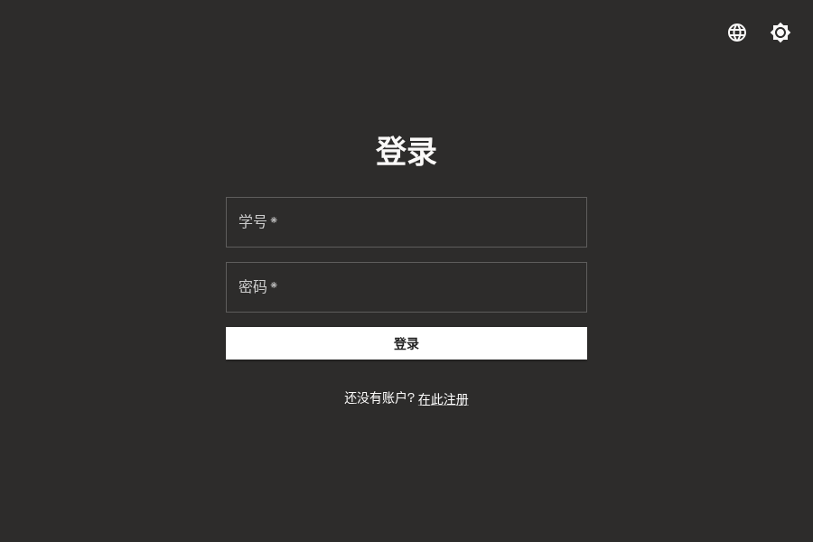
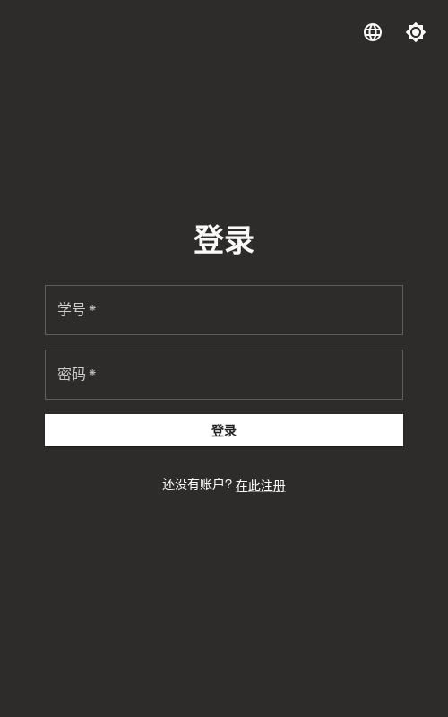
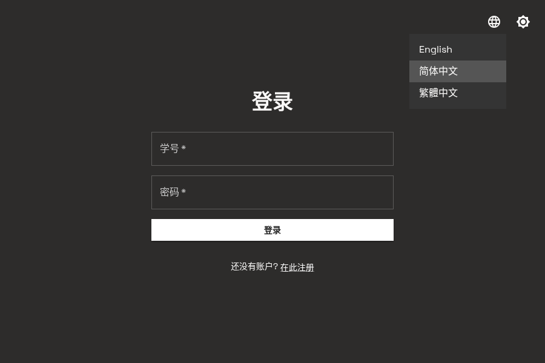
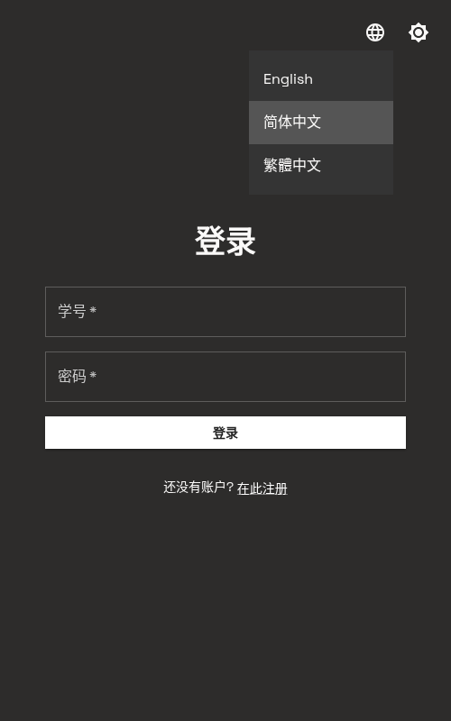
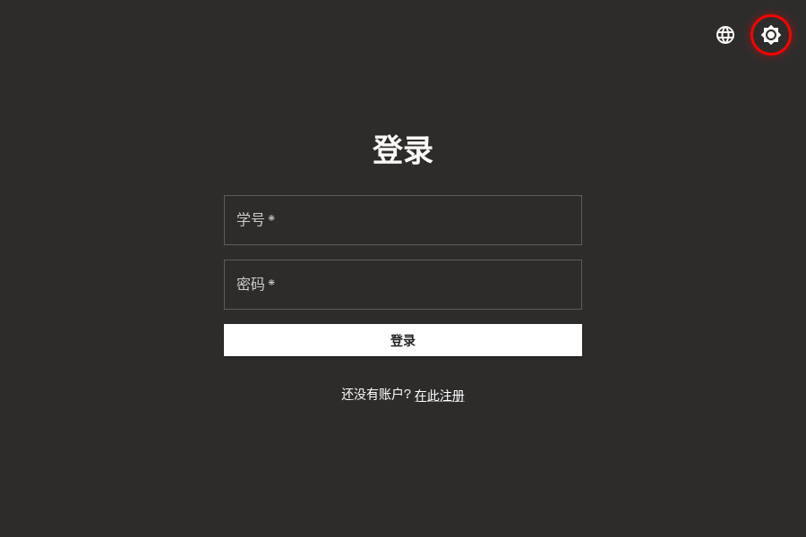
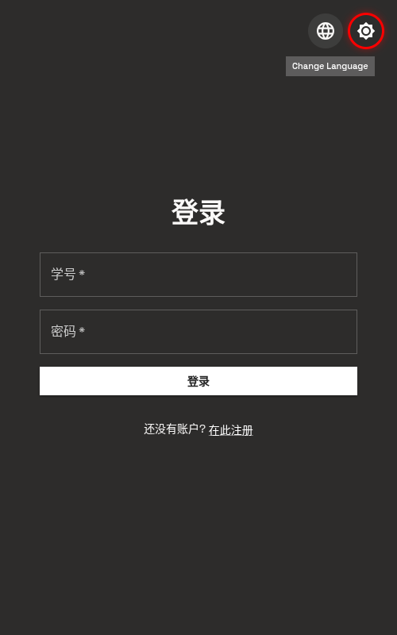
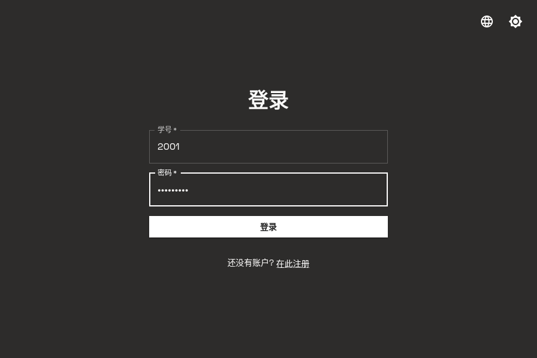
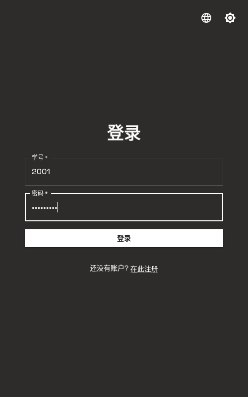
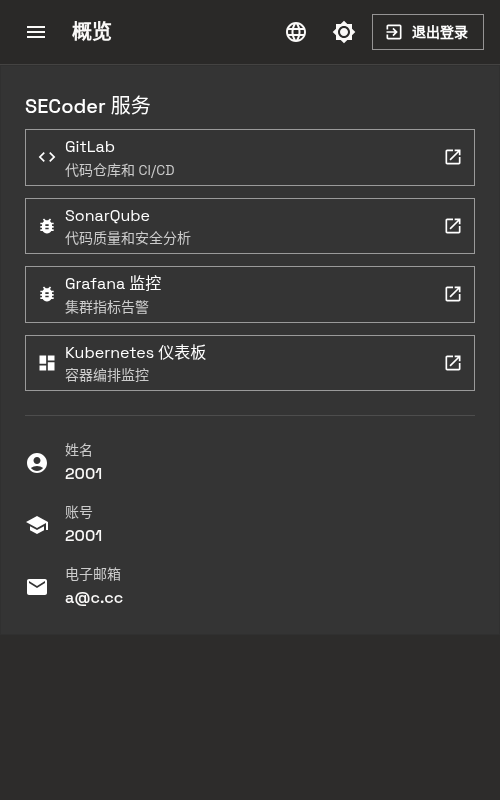

# 用户登录

登录是使用 SECoder 平台的第一步, 本章将指导你完成登录流程.

<!-- TODO(screenshots): 重拍本章登录页截图; 现有图片早于“记住登录”复选框. -->

## 访问登录页面

在浏览器中打开 [https://@@SECODER_BASE_DOMAIN@@](https://@@SECODER_BASE_DOMAIN@@),
系统会自动跳转到登录页面.

  
  

## 语言切换

登录页面支持多语言切换, 你可以点击页面右上角的地球图标,
在弹出的菜单中选择你需要的语言.

  
  

系统支持三种语言:

- **English** - 英文界面
- **简体中文** - 简体中文界面(默认)
- **繁體中文** - 繁体中文界面

选择语言后, 页面会立即切换到对应的语言显示.

## 主题切换

登录页面支持亮色和暗色模式切换, 你可以点击页面右上角的主题切换按钮来切换显示模式.

  
  

点击该按钮后, 页面会在亮色模式和暗色模式之间切换. 浏览器会保存你的选择;
没有已保存选择时, 页面跟随操作系统的亮色或暗色偏好.

## 登录页面元素

登录页面包含以下元素:

- **学号输入框**: 输入你的学号
- **密码输入框**: 输入你的密码
- **记住登录**: 在关闭浏览器后继续保留登录状态
- **登录按钮**: 点击完成登录
- **注册链接**: 如果没有账号, 可以点击"在此注册"进行注册

## 填写登录信息

在对应的输入框中填写你的学号和密码.

  
  

1. 在 **学号** 输入框中填写你的学号
2. 在 **密码** 输入框中填写你的密码
3. 如果需要跨浏览器会话保留登录状态, 勾选 **记住登录**

未勾选 **记住登录** 时, 凭据保存在浏览器会话 Cookie 中, 关闭浏览器会结束该会话.
勾选后, 凭据会保存在当前浏览器的本地存储中. 两种方式都受服务端登录令牌有效期限制;
不要在公共或共享设备上勾选此项, 使用完毕后应点击 **退出登录**.

## 完成登录

点击 **登录** 按钮完成登录.

  
  

登录成功后, 系统会跳转到概览页面, 你可以开始使用 SECoder 平台的各种功能.

## 常见问题

### 忘记密码

如果你忘记了密码, 请联系课程管理员重置密码.

### 账号被禁用

当前代码不会因为连续输错密码而自动临时锁定账号. 如果正确的账号和密码仍被拒绝,
账号可能尚未由课程管理员加入注册名单, 或已经被管理员禁用; 请联系课程管理员核对.

### 无法登录

如果遇到无法登录的问题, 请检查:

- 学号和密码是否输入正确
- 浏览器是否支持(推荐使用 Chrome, Firefox 或 Edge)
- 网络连接是否正常
