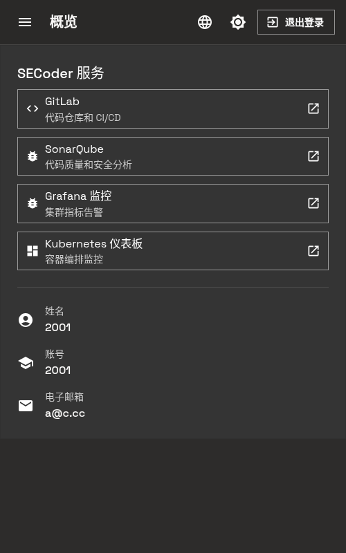
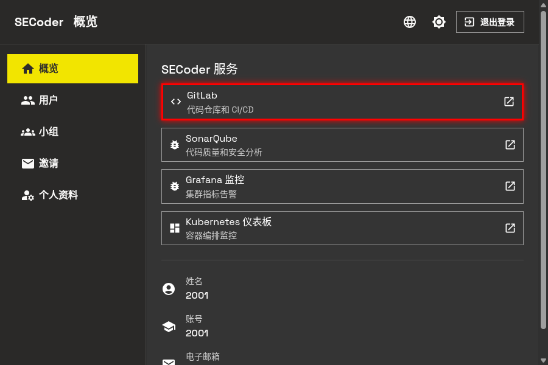
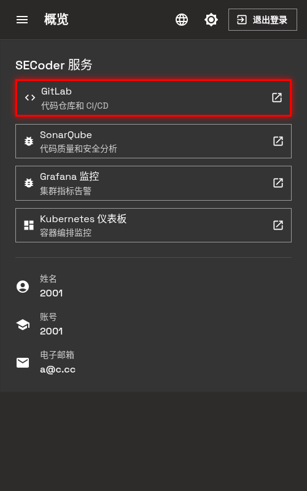
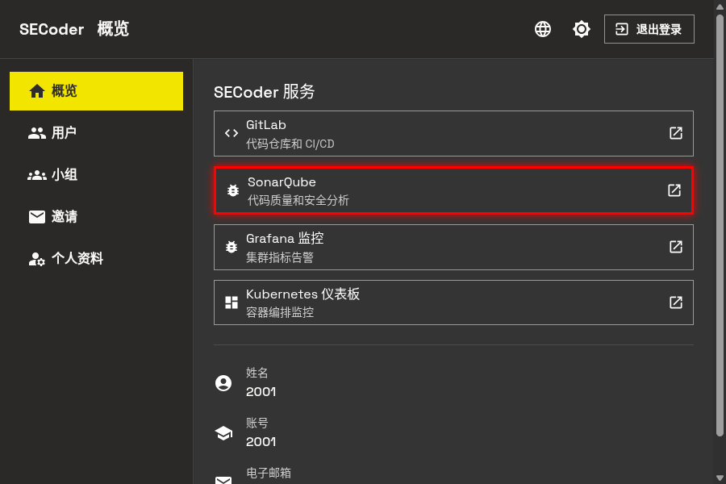
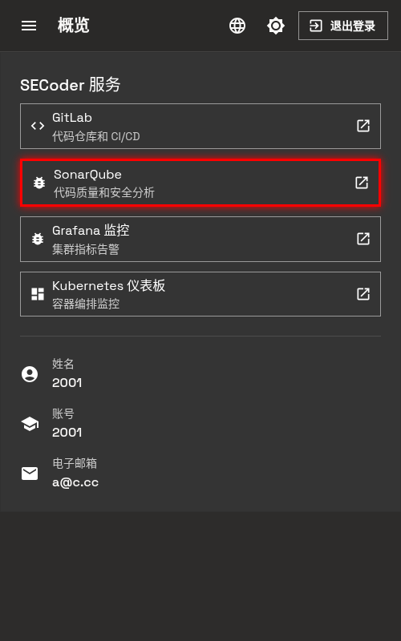
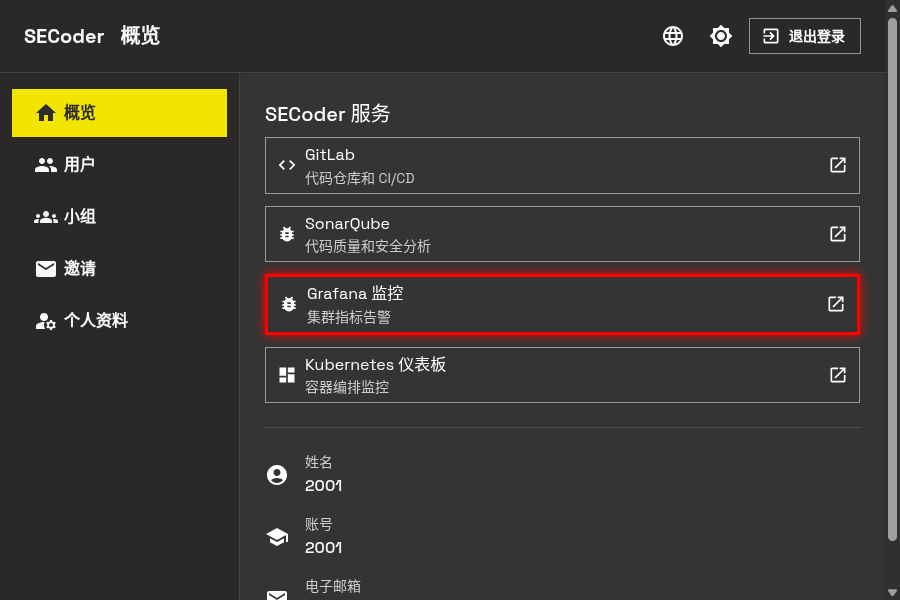
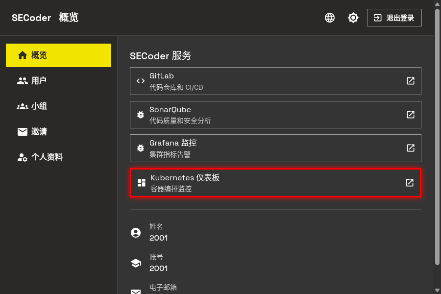
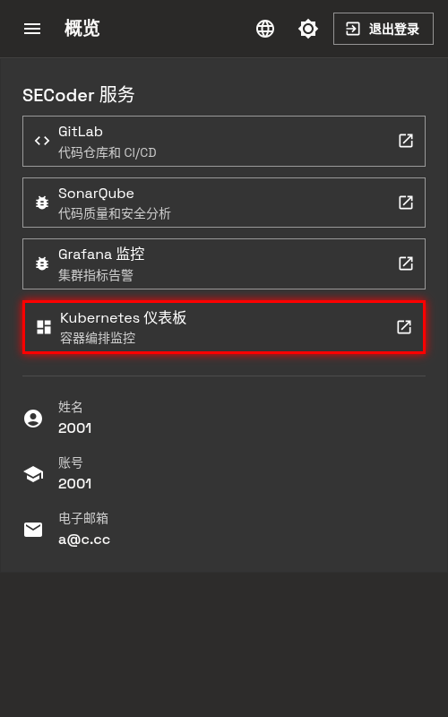
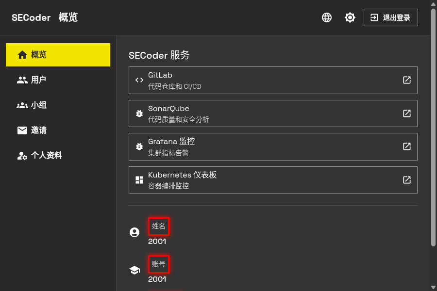
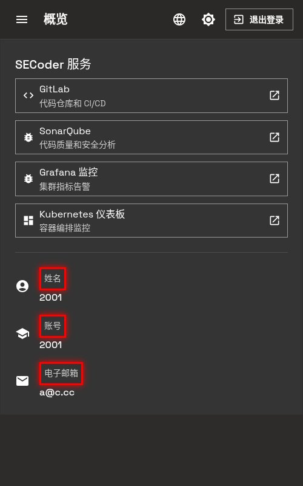

# 主界面

成功登录后, 你将进入 SECoder 的主界面 (概览页面). 这个页面是你使用平台各项功能的入口, 集成了多个开发运维服务。

## 界面概览

主界面采用简洁的卡片式布局, 主要包含两个部分:

- **SECoder 服务区**: 展示可用的开发工具和服务
- **用户信息区**: 显示你的个人账户信息

  
  

## SECoder 服务

主界面提供了四个核心服务, 每个服务都通过按钮快速访问:

### GitLab 代码仓库和 CI/CD

GitLab 是一个基于 Web 的 DevOps 生命周期工具, 提供 Git 代码仓库管理、持续集成/持续部署 (CI/CD)、代码审查等功能。

点击 **GitLab 代码仓库和 CI/CD** 按钮将跳转到 GitLab 服务页面。

  
  

在 GitLab 中, 你可以:
- 创建和管理代码仓库
- 配置 CI/CD 流水线自动化构建和部署
- 进行代码审查和合并请求
- 管理项目成员和权限

### SonarQube 代码质量和安全分析

SonarQube 是一个开源的代码质量和安全分析平台, 能够检测代码中的 bug、漏洞和代码异味。

点击 **SonarQube 代码质量和安全分析** 按钮将跳转到 SonarQube 服务页面。

  
  

通过 SonarQube, 你可以:
- 查看代码质量评分
- 识别代码中的潜在问题
- 跟踪技术债务
- 检查安全漏洞

### Grafana 监控 集群指标告警

Grafana 是一个开源的分析和可视化平台, 用于监控和分析系统指标。

点击 **Grafana 监控 集群指标告警** 按钮将跳转到 Grafana 服务页面。

  
  

在 Grafana 中, 你可以:
- 查看集群资源使用情况
- 监控应用性能指标
- 设置告警规则
- 可视化时间序列数据

### Kubernetes 仪表板 容器编排监控

Kubernetes Dashboard 是 Kubernetes 集群的 Web 界面, 用于管理和监控容器化应用。

点击 **Kubernetes 仪表板 容器编排监控** 按钮将跳转到 Kubernetes 服务页面。

  
  

通过 Kubernetes Dashboard, 你可以:
- 查看集群状态和节点信息
- 管理部署、服务和 ingress
- 查看容器日志
- 监控资源使用情况

## 用户信息

主界面底部显示了你的个人账户信息, 包括:

- **姓名**: 你在注册时填写的姓名
- **账号**: 你的学号
- **电子邮箱**: 你在注册时填写的邮箱

  
  

这些信息与 GitLab 等服务同步, 确保各平台间数据的一致性。如需修改, 请联系助教或使用平台提供的账号管理功能。

## 导航栏

页面顶部的导航栏提供了以下功能:

- **菜单按钮**: 展开侧边栏导航
- **概览**: 当前页面标题
- **Change Language**: 切换界面语言 (中英文)
- **主题切换**: 切换深色/亮色模式
- **退出登录**: 退出当前账户
