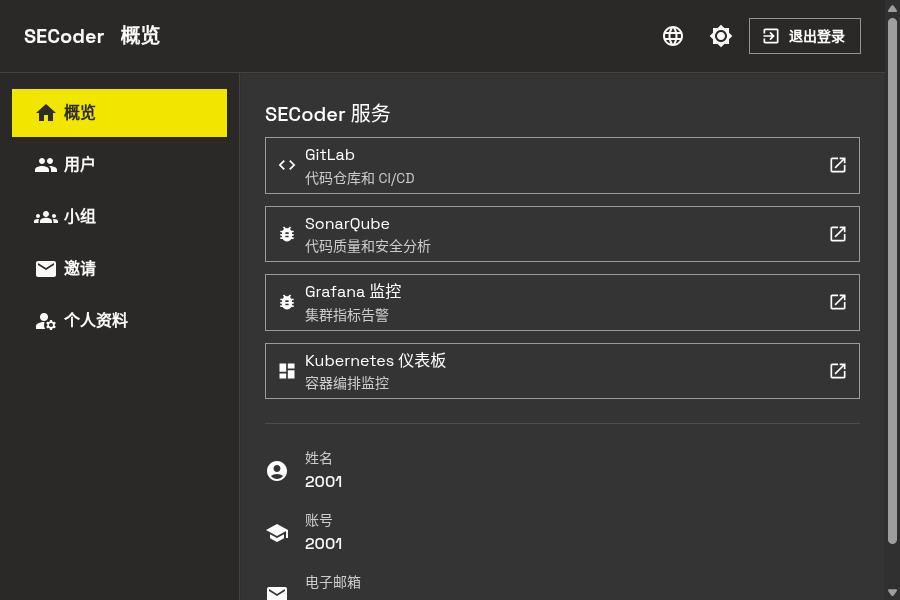
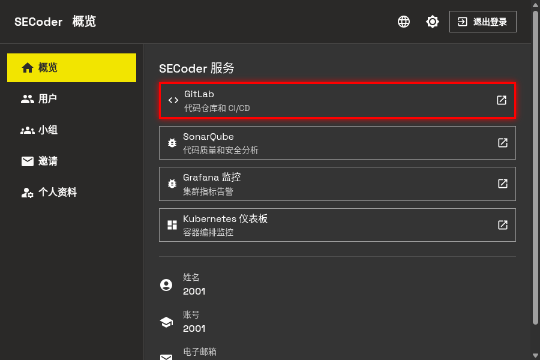
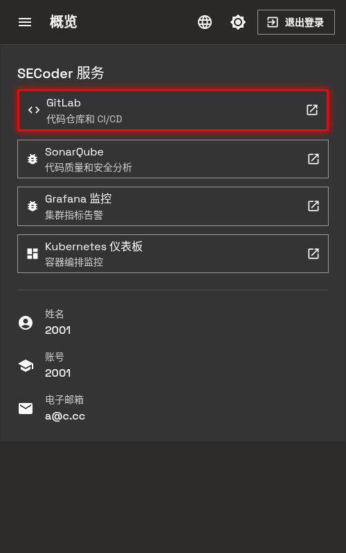
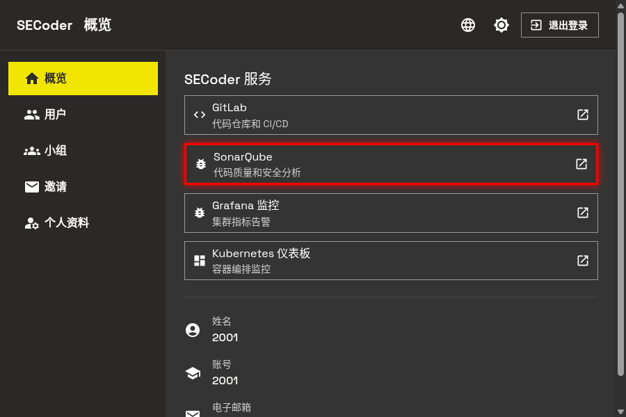
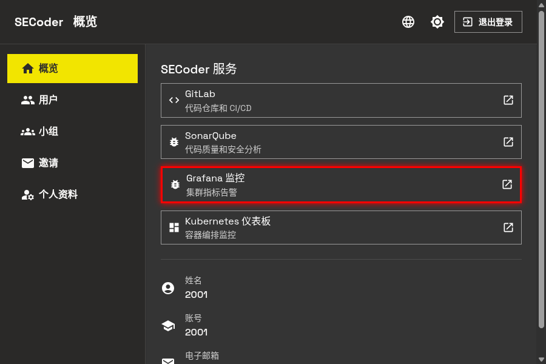
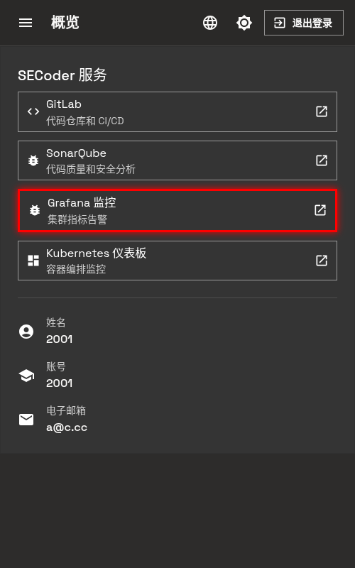
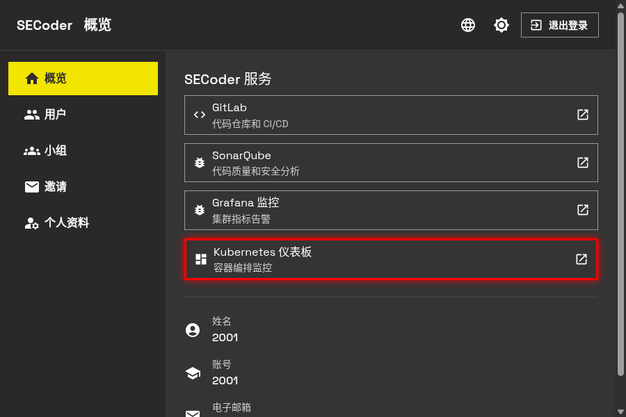
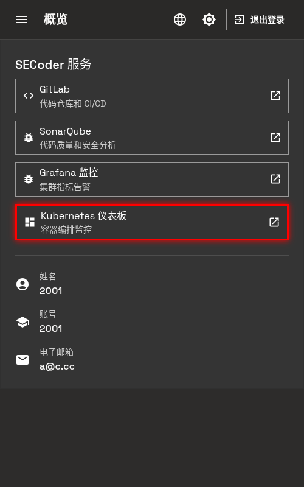
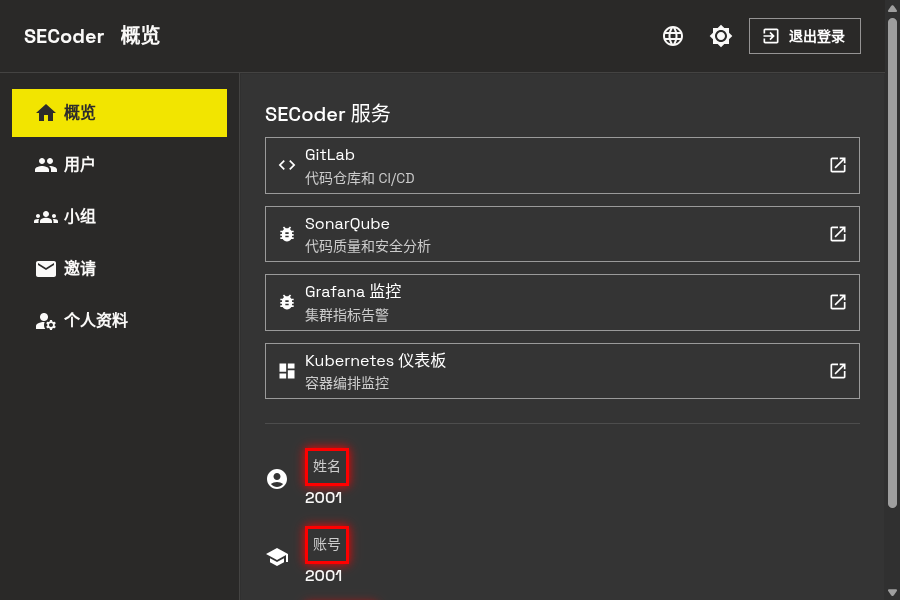
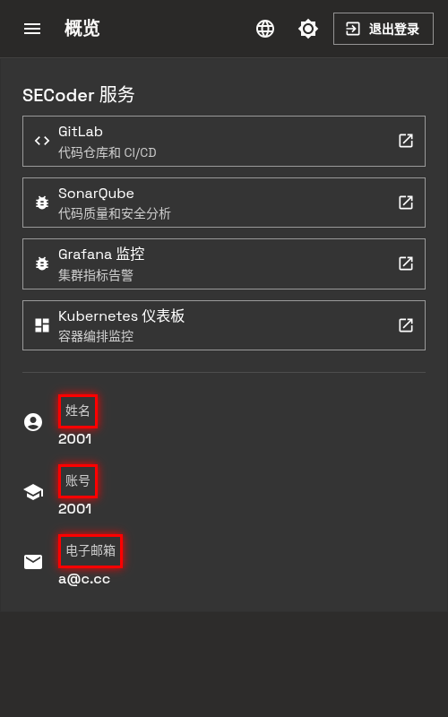

# 主界面

成功登录后, 你将进入 SECoder 的主界面 (概览页面).
这个页面是你使用平台各项功能的入口, 集成了多个开发运维服务.

## 界面概览

主界面采用简洁的卡片式布局, 主要包含两个部分:

- **SECoder 服务区**: 展示可用的开发工具和服务
- **用户信息区**: 显示你的个人账户信息

  
  

## SECoder 服务

主界面提供了四个核心服务, 每个服务都通过按钮快速访问:

### GitLab 代码仓库和 CI/CD

GitLab 是一个基于 Web 的 DevOps 生命周期工具, 提供 Git 代码仓库管理,
持续集成/持续部署 (CI/CD), 代码审查等功能.

点击 **GitLab** 按钮将跳转到 GitLab 服务页面.

  
  

在 GitLab 中, 你可以:

- 创建和管理代码仓库
- 配置 CI/CD 流水线自动化构建和部署
- 进行代码审查和合并请求
- 管理项目成员和权限

**相关文档**: [GitLab 官方文档](https://docs.gitlab.com/) | [Git 入手指南](https://docs.gitlab.com/ee/topics/git/)

### SonarQube 代码质量和安全分析

SonarQube 是一个开源的代码质量和安全分析平台, 能够检测代码中的 bug,
漏洞和代码异味.

点击 **SonarQube** 按钮将跳转到 SonarQube 服务页面.

  
  

通过 SonarQube, 你可以:

- 查看代码质量评分
- 识别代码中的潜在问题
- 跟踪技术债务
- 检查安全漏洞

**相关文档**: [SonarQube 官方文档](https://docs.sonarsource.com/)

### Grafana 监控 集群指标告警

Grafana 是一个开源的分析和可视化平台, 用于监控和分析系统指标.

点击 **Grafana 监控** 按钮将跳转到 Grafana 服务页面.

  
  

在 Grafana 中, 你可以:

- 查看集群资源使用情况
- 监控应用性能指标
- 设置告警规则
- 可视化时间序列数据

### Kubernetes 仪表板 容器编排监控

SECoder 当前使用 Headlamp 提供 Kubernetes Web 界面, 前端按钮显示为
**Kubernetes 仪表板**. 普通用户主要在自己的命名空间中查看和管理容器化应用.

点击 **Kubernetes 仪表板** 按钮将跳转到 Headlamp 页面.

  
  

通过该界面, 你可以:

- 查看允许访问的集群状态和节点信息
- 管理个人命名空间中的 Deployment, StatefulSet, Service 和 HTTPRoute 等资源
- 查看容器日志
- 查看个人命名空间的资源配额与使用情况

## 用户信息

主界面底部显示了你的个人账户信息, 包括:

- **姓名**: 你在注册时填写的姓名
- **账号**: 你的学号
- **电子邮箱**: 你在注册时填写的邮箱

  
  

这些信息来自 SECoder 账户. 你可以在 **个人资料** 页面修改姓名和邮箱;
修改后需要重新登录 GitLab, 才会在下一次 SSO 时向 GitLab 提供最新信息.

## 导航栏

桌面端使用左侧边栏在 **概览**、**用户**、**小组**、**邀请** 和
**个人资料** 页面之间切换; 移动端先点击顶部菜单按钮展开侧边栏.
页面顶部还提供:

- **当前页面标题**
- **语言按钮**: 切换英文、简体中文或繁体中文
- **主题切换**: 切换深色/亮色模式
- **退出登录**: 退出当前账户
