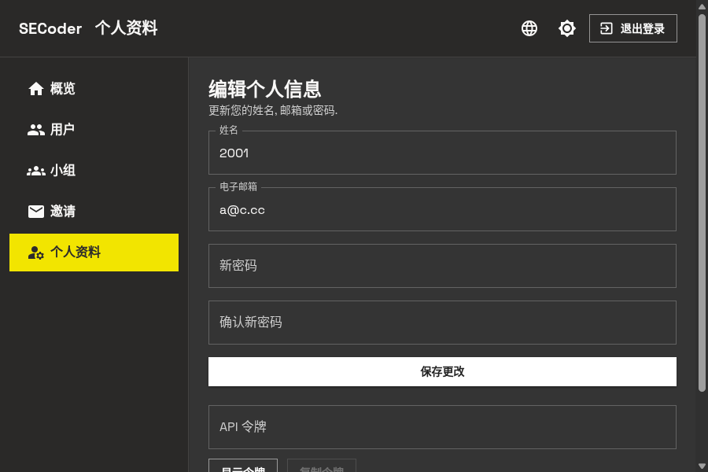
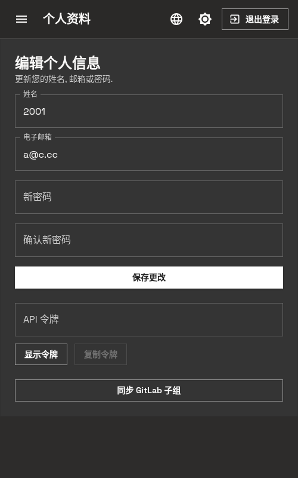
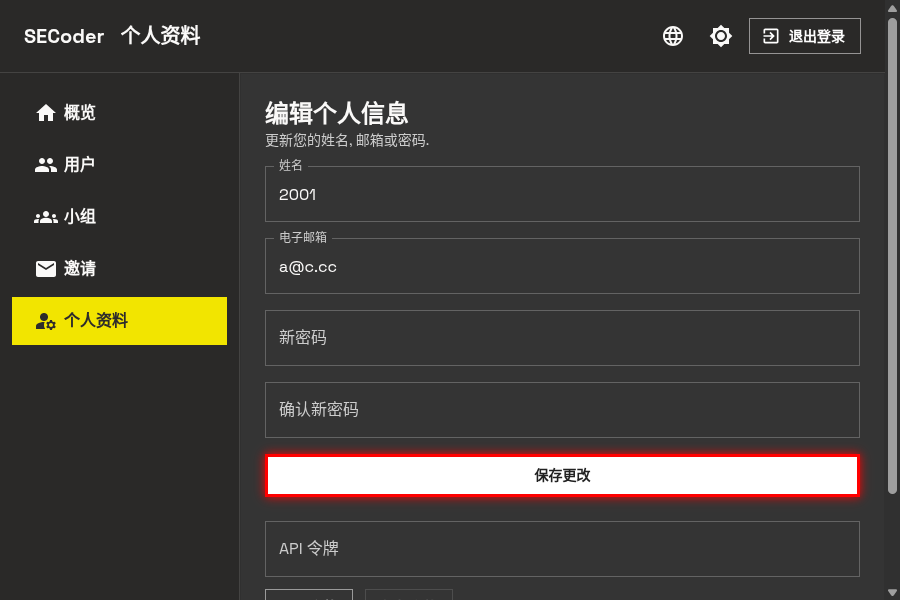
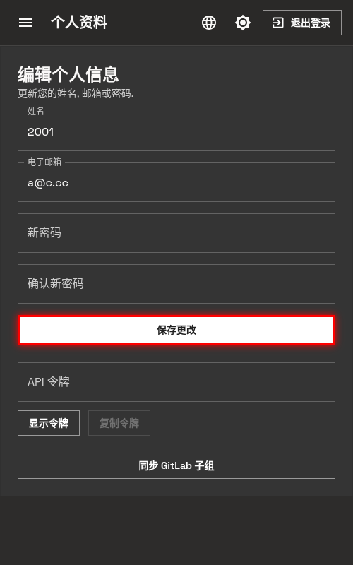
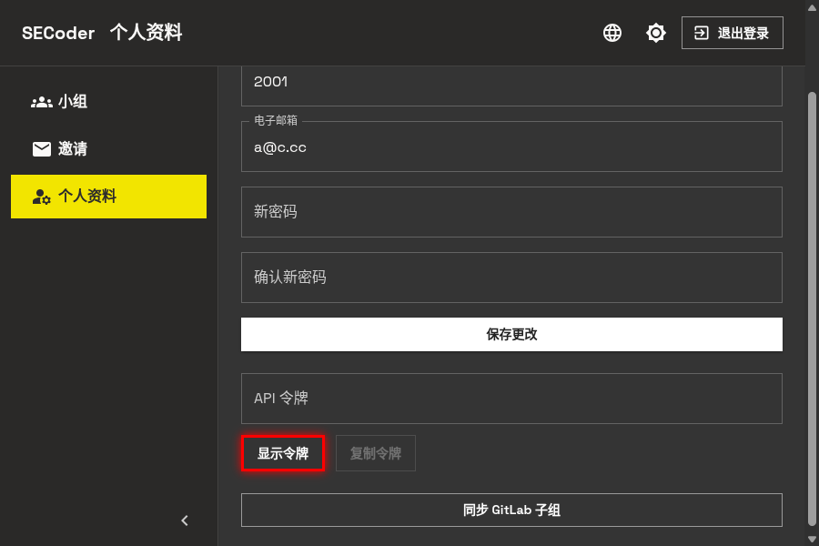
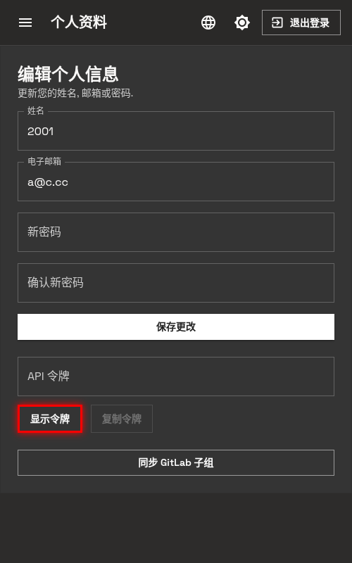
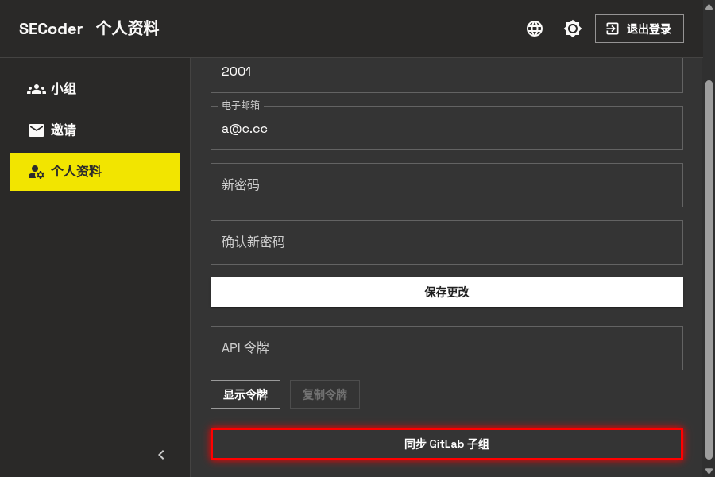
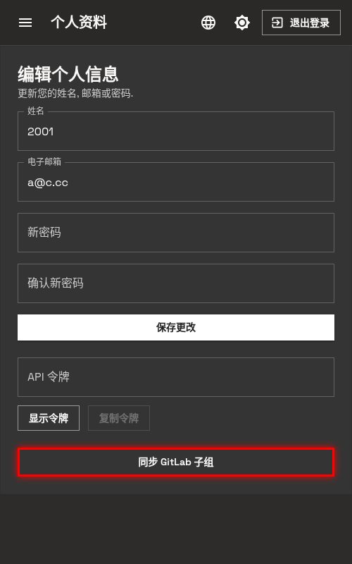

# 个人资料

个人资料页面允许你更新账户信息, 修改密码以及管理 API 令牌.

## 访问个人资料页面

登录后, 通过侧边栏导航点击 **个人资料** 即可进入个人资料页面.

## 页面概览

个人资料页面包含以下主要功能区域:

- **个人信息编辑**: 更新姓名, 电子邮箱或密码
- **API 令牌管理**: 查看和复制你的 API 令牌
- **GitLab 同步**: 同步 GitLab 子组信息

  
  

## 编辑个人信息

### 更新姓名和邮箱

你可以随时更新你的姓名和电子邮箱信息. 这些信息会同步到 GitLab 等关联服务.

1. 在 **姓名** 输入框中修改你的姓名
2. 在 **电子邮箱** 输入框中修改你的邮箱地址
3. 点击 **保存更改** 按钮提交修改

  
  

### 修改密码

为了账户安全, 建议定期修改密码.

1. 在 **新密码** 输入框中输入新密码
2. 在 **确认新密码** 输入框中再次输入相同的新密码
3. 点击 **保存更改** 按钮完成密码修改

**注意**: 新密码需要满足系统的安全要求, 建议包含大小写字母, 数字和特殊字符.

## 管理 API 令牌

API 令牌用于通过编程方式访问 SECoder 平台的 API 接口.

### 显示令牌

出于安全考虑, API 令牌默认是隐藏的. 点击 **显示令牌** 按钮可以查看你的令牌.

  
  

### 复制令牌

令牌显示后, **复制令牌** 按钮将变为可用状态. 点击该按钮可以将令牌复制到剪贴板, 方便你在代码或 API 工具中使用.

**安全提示**:
- API 令牌等同于你的账户密码, 请妥善保管
- 不要将令牌分享给他人或公开发布在代码仓库中
- 如果令牌泄露, 请立即联系管理员重置

## 同步 GitLab 子组

当你加入新的团队或组队情况发生变化时, 需要同步 GitLab 子组信息.

点击 **同步 GitLab 子组** 按钮, 系统会将最新的组队信息同步到 GitLab, 确保你拥有正确的项目访问权限.

  
  

**建议在以下情况执行同步**:
- 首次使用平台
- 加入新的课程小组
- 组队成员发生变化
- 发现 GitLab 中缺少某些项目权限
