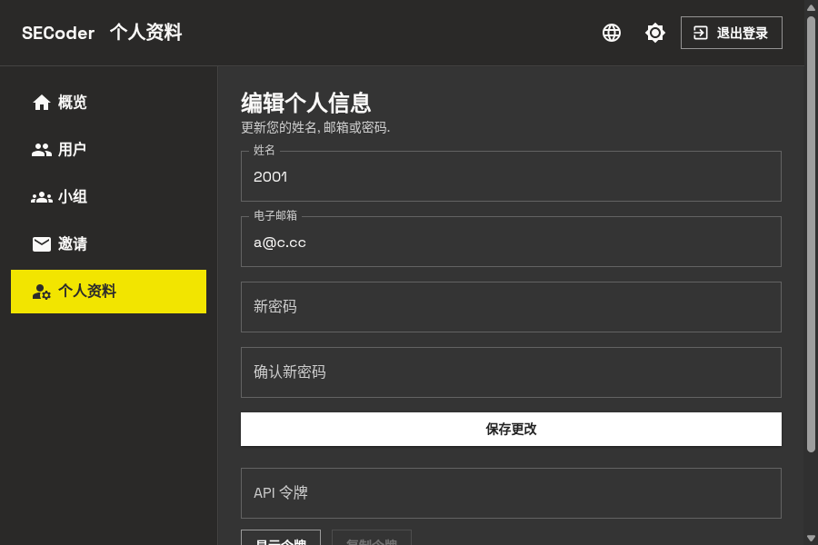
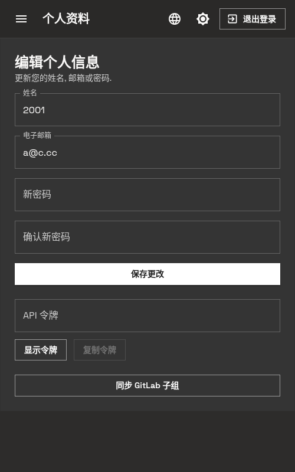
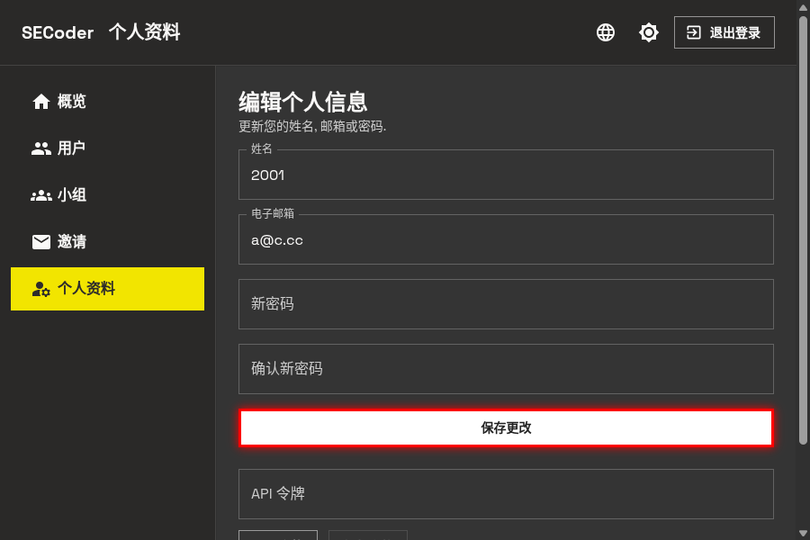
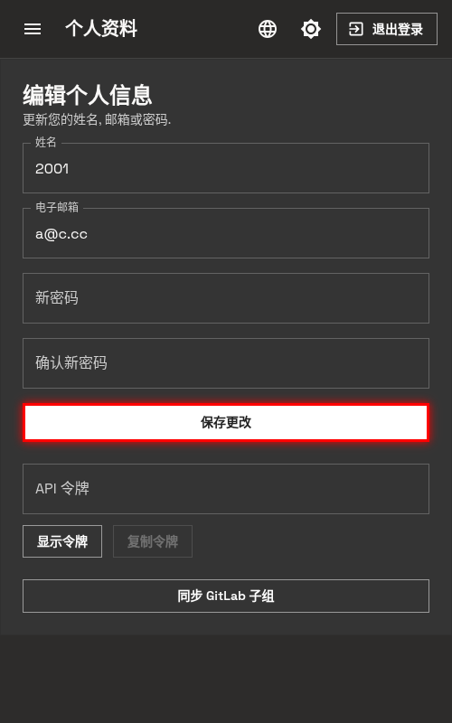
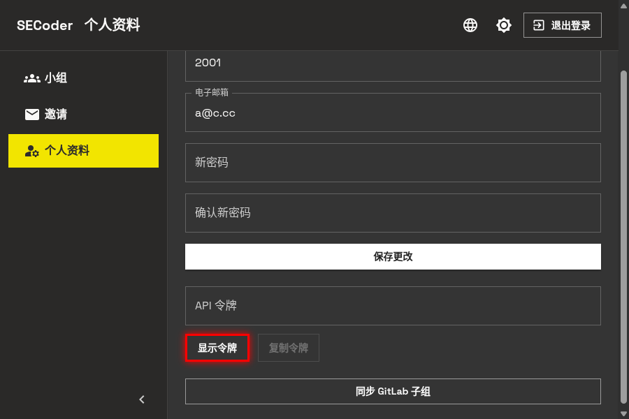
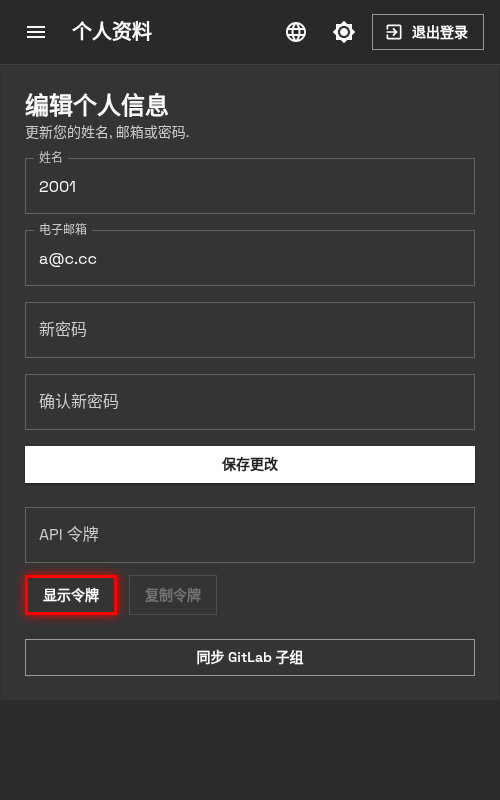
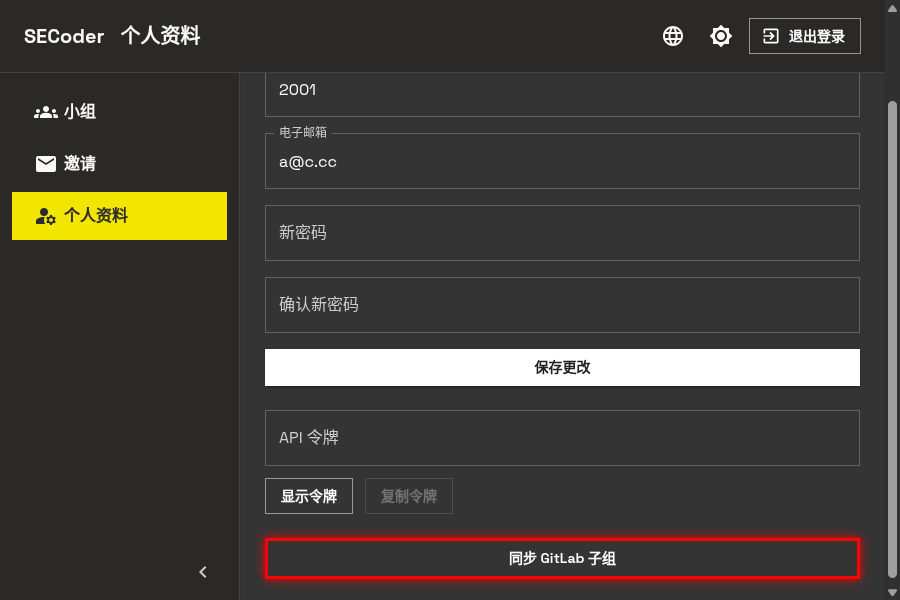
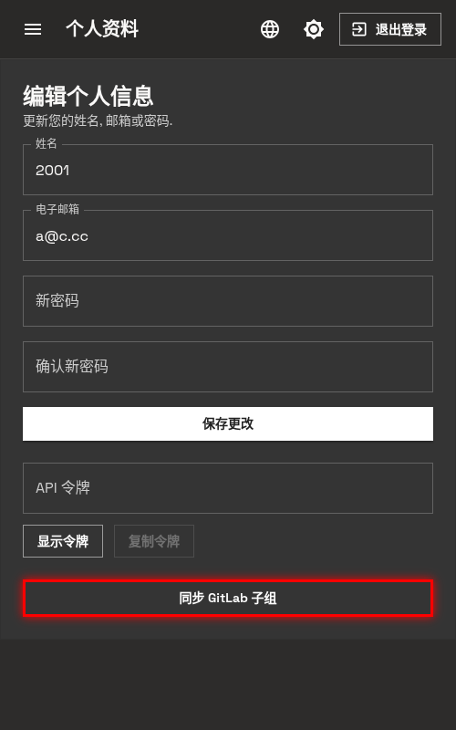

# 个人资料

个人资料页面允许你更新账户信息, 修改密码以及管理 Kubernetes 访问凭据.

<!-- TODO(screenshots): 重拍本章个人页截图; 现有图片缺少下载 kubeconfig 和轮换令牌按钮. -->

## 访问个人资料页面

登录后, 通过侧边栏导航点击 **个人资料** 即可进入个人资料页面.

## 页面概览

个人资料页面包含以下主要功能区域:

- **个人信息编辑**: 更新姓名, 电子邮箱或密码
- **Kubernetes 凭据管理**: 显示、复制或轮换 API 令牌, 并下载 kubeconfig
- **GitLab 同步**: 同步 GitLab 子组信息

<div style="display: flex; gap: 5%; align-items: center; justify-content: center;">
  
  
</div>

## 编辑个人信息

### 更新姓名和邮箱

你可以随时更新你的姓名和电子邮箱信息. 保存成功约 2 秒后, SECoder 会清除当前登录
并返回登录页, 以免旧令牌继续携带修改前的信息. 重新登录 GitLab 后,
GitLab 才会在下一次 SSO 中收到新姓名和邮箱.

1. 在 **姓名** 输入框中修改你的姓名
2. 在 **电子邮箱** 输入框中修改你的邮箱地址
3. 点击 **保存更改** 按钮提交修改

<div style="display: flex; gap: 5%; align-items: center; justify-content: center;">
  
  
</div>

### 修改密码

为了账户安全, 建议定期修改密码.

1. 在 **新密码** 输入框中输入新密码
2. 在 **确认新密码** 输入框中再次输入相同的新密码
3. 点击 **保存更改** 按钮完成密码修改

**注意**: 当前后端不会替你检查密码复杂度. 请主动使用足够长且不与其他服务复用的密码;
修改后页面会要求重新登录.

## 管理 Kubernetes API 令牌

页面上显示为 **API 令牌** 的凭据实际用于访问 SECoder Kubernetes API,
不是调用 SECoder 账户后端接口的登录令牌. GitLab CI 部署和下载的 kubeconfig
都使用这一 Kubernetes 凭据.

### 显示令牌

出于安全考虑, API 令牌默认是隐藏的. 点击 **显示令牌** 按钮可以查看你的令牌.

<div style="display: flex; gap: 5%; align-items: center; justify-content: center;">
  
  
</div>

### 复制令牌

令牌显示后, **复制令牌** 按钮将变为可用状态. 点击该按钮可以将令牌复制到剪贴板, 方便你在代码或 API 工具中使用.

### 轮换令牌

如果令牌或 kubeconfig 可能泄露, 点击 **轮换令牌**, 阅读警告并确认. 页面会显示新令牌;
此前复制的令牌、下载的 kubeconfig, 以及使用旧令牌的 GitLab CI `TOKEN` 变量都会失效.
轮换后应立即更新仍需使用的 CI 变量并重新下载 kubeconfig.

### 下载 kubectl 配置

点击 **下载 kubectl 配置** 按钮, 阅读并确认凭据安全提示后, 浏览器会下载一个
`u-<你的用户 ID>.kubeconfig` 文件. 该文件已经包含访问 SECoder Kubernetes 集群
所需的 API 地址、用户令牌、当前上下文和你的默认命名空间.

下载后可以通过以下任一方式使用:

1. 临时指定该配置文件执行 kubectl 命令:

   ```bash
   KUBECONFIG=/path/to/u-<你的用户 ID>.kubeconfig kubectl get pods
   ```

2. 在当前 shell 会话中设置环境变量:

   ```bash
   export KUBECONFIG=/path/to/u-<你的用户 ID>.kubeconfig
   kubectl get pods
   kubectl get services
   ```

3. 如果你希望长期使用, 可以将该配置合并到本机默认 kubeconfig 中:

   ```bash
   mkdir -p ~/.kube
   KUBECONFIG=~/.kube/config:/path/to/u-<你的用户 ID>.kubeconfig kubectl config view --flatten > /tmp/secoder-kubeconfig
   mv /tmp/secoder-kubeconfig ~/.kube/config
   chmod 600 ~/.kube/config
   ```

配置文件默认会切换到你的个人命名空间, 因此通常可以直接执行 `kubectl get pods`, `kubectl apply -f deployment.yaml` 等命令. 如果需要确认当前上下文和命名空间, 可以运行:

```bash
kubectl config current-context
kubectl config view --minify --output 'jsonpath={..namespace}'; echo
```

**安全提示**:
- API 令牌和下载的 kubectl 配置等同于你的账户密码, 请妥善保管
- 不要将令牌或 kubectl 配置分享给他人, 也不要公开发布在代码仓库中
- 如果令牌或 kubectl 配置泄露, 立即在本页轮换令牌; 无法登录时再联系管理员

## 同步 GitLab 子组

当你加入新的团队或组队情况发生变化时, 需要同步 GitLab 子组信息.

点击 **同步 GitLab 子组** 按钮, 系统会将最新的组队信息同步到 GitLab, 确保你拥有正确的项目访问权限.

<div style="display: flex; gap: 5%; align-items: center; justify-content: center;">
  
  
</div>

**建议在以下情况执行同步**:
- 首次使用平台
- 加入新的课程小组
- 组队成员发生变化
- 发现 GitLab 中缺少某些项目权限
